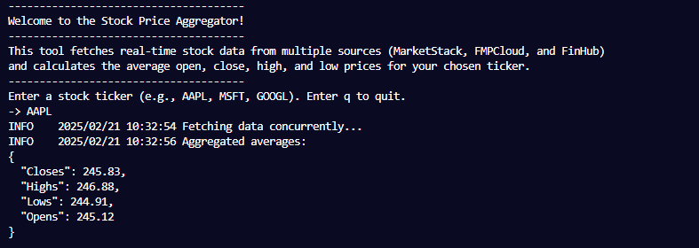
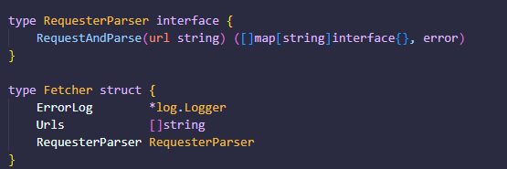
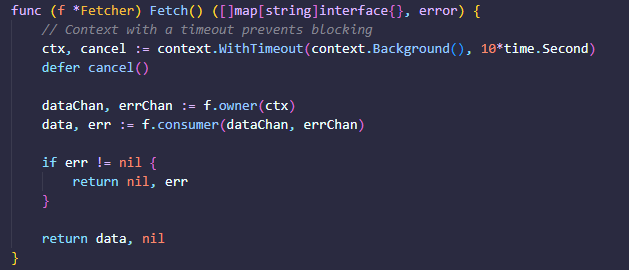
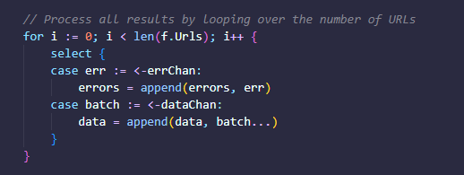
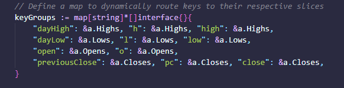

# 📈 Stock Market Aggregator

This repository contains a **Stock Market Aggregator** CLI program built with Go.

## 🧑‍💻 About the Project

The project is designed to collect **stock market data** from free APIs (MarketStack, FMPCloud, and FinHub) and aggregate the data to show the **average price** of stocks, given a user inputs a stock ticker into a prompt.

---

### 🎯 Project Goal

The main goal of this project is to implement **Go-native concurrency patterns** and apply them in a real-world scenario of fetching and processing stock data.

Testing goal is to keep testing coverage above 80%.

---

### 📷 Screen Capture

---

### 📋 Project Breakdown

**Main Program** initializes the application, sets up logging, and controls the flow between data fetching and aggregation.

- Loads environment variables (using the godotenv package).
- Initializes logging for information and error messages.
- Creates instances of the Fetcher and Aggregator modules.
- Fetches stock data by calling the Fetcher's Fetch function.
- Passes the fetched data to the Aggregator to aggregate the stock prices.

**Data Fetching** retrieves stock data from free stock market APIs, concurrently.

- Fetches stock data using multiple free APIs (such as FMP Cloud).
- Each URL request is handled concurrently using Go's goroutines, ensuring efficient data fetching.
- Errors are logged if there are any issues with the API requests.
- The Fetch method of the Fetcher returns the raw data for further processing.

**Data Aggregation** aggregates the fetched stock data.

- Receives the fetched stock data from the Fetcher.
- For now, the method only logs that aggregation is attempted (to be expanded in future development).

**Utility functions**

- Converting a slice of interfaces into a slice of maps
- Rounding a float64 to two decimals
- Pretty printing a JSON object to improve readabilty

---

### 🧪 Testing

Built-in `testing` library is used for unit and integration tests.
Current coverage: 85.9% of statements of fetcher package.

---

### 😃 Code Snippets I am excited about

<fieldset align="center">
<legend align="left">RequesterParser struct allows for modularity and easy testing</legend>

</fieldset>

 

<fieldset align="center">
<legend align="left">Owner-consumer pattern in fetch function for improved modularity</legend>

</fieldset>

 

<fieldset align="center">
<legend align="left">For-select pattern for receiving channel values</legend>

</fieldset>

 

<fieldset align="center">
<legend align="left">Dynamic routing of values to the respective slices</legend>

</fieldset>
